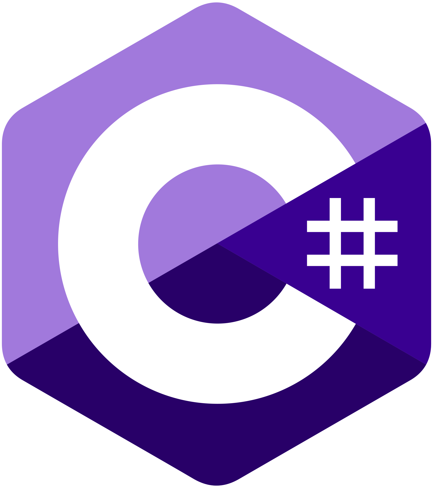
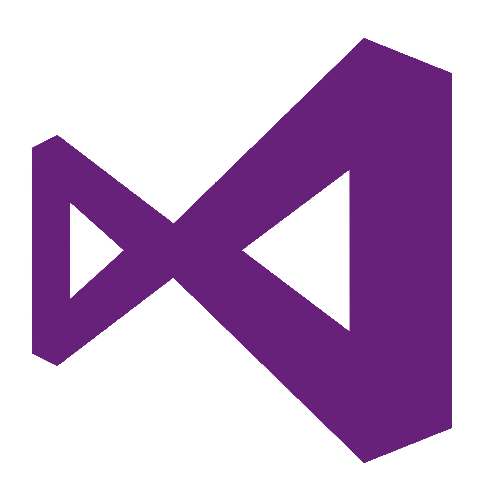

[](https://saschamanns.de)

# Hi there, I'm <a href="https://saschamanns.de" target="_blank">Sascha Manns</a> 

[](https://www.linkedin.com/in/saigkill)
[](https://saschamanns.de)
[](https://twitter.com/saigkill)
[](https://www.xing.com/profile/SaschaZyroslawKyrill_Manns/cv)
[](https://www.reddit.com/user/saigkill000)
[](https://discord.com/channels/@saigkill001#3216)
[](https://mastodon.social/@sascha_Manns)
[](https://profile.codersrank.io/user/saigkill)
[](https://matrix.to/#/@sascha.manns:matrix.org)
[](https://www.last.fm/user/illuminatus1979)

This is the home place for my open source work &nbsp; 

- 🔭 &nbsp;I’m currently writing interfaces to connect our customers data with our application for manage our random samples.

- 🌱 &nbsp;I’m currently learning to build Desktop GUI Apps for Linux.

- 💬 &nbsp;Employment status: Unemployed

- 👨‍💻 &nbsp;My resume can shown on [Codersrank](https://profile.codersrank.io/user/saigkill).

📕 &nbsp;**Latest Blog Posts**

<!-- BLOG-POST-LIST:START -->
- [Api Client für das Arbeitsamt](https://saschamanns.de/post/2025/6/8/api-client-fuer-das-deutsche-arbeitsamt)
- [Api Client for the German Employment Agency](https://saschamanns.de/post/2025/6/8/api-client-for-the-german-employment-agency)
- [Meet &amp; Greet: Prof. Dr. Julian Kunkel](https://saschamanns.de/post/2024/10/18/meet-and-greet-prof-dr-julian-kunkel)
- [Saigkills Toolbox 1.0.0](https://saschamanns.de/post/2024/10/17/saigkills-toolbox-100-en)
- [Saigkills Toolbox 1.0.0](https://saschamanns.de/post/2024/10/17/saigkills-toolbox-100)
<!-- BLOG-POST-LIST:END -->
<br />

📊 &nbsp;**This week I spent my time on**


<details>
  <summary><b>✨&nbsp;&nbsp;About&nbsp;Me</b></summary>
  <br />
  I am a .NET Developer with 5+ years of experience in developing enterprise applications and open source software.
  All my projects on Github are released under a open source license, so you can use it for any case under their terms.

[⏩ &nbsp; and many more](https://github.com/saigkill?tab=repositories&q=&type=source&language=&sort=stargazers)
```
  ____                  ____                      
 / __ \___  ___ ___    / __/__  __ _____________  
/ /_/ / _ \/ -_) _ \  _\ \/ _ \/ // / __/ __/ -_) 
\____/ .__/\__/_//_/ /___/\___/\_,_/_/  \__/\__/  
   _/_/                  __  __   _               
  / __/  _____ ______ __/ /_/ /  (_)__  ___ _     
 / _/| |/ / -_) __/ // / __/ _ \/ / _ \/ _ `/ _ _ 
/___/|___/\__/_/  \_, /\__/_//_/_/_//_/\_, (_|_|_)
                 /___/                /___/       
```

Sascha Manns is a German software developer and book author. As a software and data engineer at infas Institute for Applied Social Sciences, I play a key role in creating and maintaining robust databases that are essential for our data-driven research projects. My focus is on developing internal applications that enable efficient data collection and analysis, as well as integrating middleware solutions that optimize the system landscape.

🐧 &nbsp;**Latest Open Source Contributions**
- [On Google CodeIn for KDE](https://www.google-melange.com/archive/gci/2012/orgs/kde/tasks/8009206.html)
- [On Github](https://github.com/pulls?q=is%3Apr+author%3A%40me+archived%3Afalse+sort%3Aupdated-desc+is%3Aclosed)
- [On German Informatics Society](https://ak-oss.gi.de/)
</details>

<details>
  <summary><b>🛠️&nbsp;&nbsp;Languages&nbsp;and&nbsp;Tools</b></summary>
  <br/>
  <a href="https://azure.microsoft.com/en-in/" target="_blank">  </a> 
<a href="https://www.gnu.org/software/bash/" target="_blank">  </a> 
<a href="https://getbootstrap.com" target="_blank">  </a> 
<a href="https://www.w3schools.com/css/" target="_blank">  </a> 
<a href="https://www.docker.com/" target="_blank">  </a> 
<a href="https://git-scm.com/" target="_blank">  </a> 
<a href="https://graphql.org" target="_blank">  </a> 
<a href="https://www.w3.org/html/" target="_blank">  </a> 
<a href="https://developer.mozilla.org/en-US/docs/Web/JavaScript" target="_blank">  </a> 
<a href="https://www.linux.org/" target="_blank">  </a> 
<a href="https://www.microsoft.com/en-us/sql-server" target="_blank">  </a> 
<a href="https://www.mysql.com/" target="_blank">  </a> 
<a href="https://nodejs.org" target="_blank">  </a> 
<a href="https://postman.com" target="_blank">  </a> 
<a href="https://www.sqlite.org/" target="_blank">  </a> 
<a href="https://www.typescriptlang.org/" target="_blank">  </a>
<a href="https://sonarcloud.io" target="_blank">  </a>
<a href="https://dotnet.microsoft.com/en-us/languages/csharp" target="_blank"> </a>
<a href="https://dotnet.microsoft.com/" target="_blank"> </a>
<a href="https://visualstudio.microsoft.com/de/" target="_blank"> </a>
<a href="https://visualstudio.microsoft.com/de/" target="_blank"> </a>
<a href="https://www.jetbrains.com/resharper/" target="_blank"> </a>
<a href="https://visualstudio.microsoft.com/vs/features/wpf/" target="_blank"> </a>
<a href="https://www.syncfusion.com/" target="_blank"> </a>
<a href="https://learn.microsoft.com/en-us/aspnet/core/introduction-to-aspnet-core?view=aspnetcore-7.0" target="_blank"> </a>
<a href="https://learn.microsoft.com/en-us/aspnet/core/blazor/?view=aspnetcore-7.0" target="_blank"> </a>
</details>
